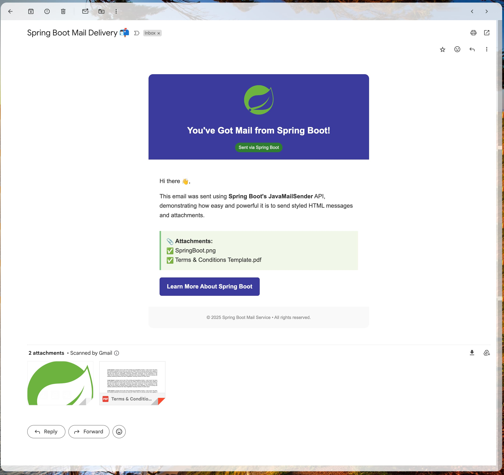
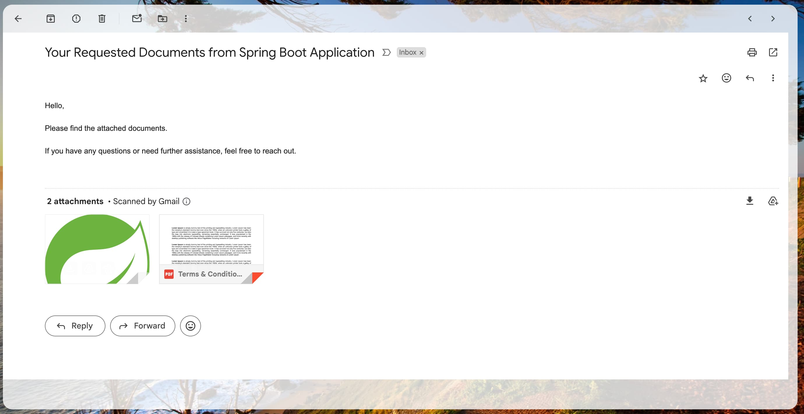

<h1 align="center">
  📬 SpringBoot-JavaMailSender
</h1>

  
  
  

  <b>A Spring Boot project to send stylish HTML emails with attachments using JavaMailSender.</b>

## ✨ Features

- ✅ Send plain text and **HTML-styled emails**
- 📎 Attach **PDFs**, images, and files
- 🖼️ Support for **inline images** in email body
- 🛡️ SMTP secured via **Gmail TLS (587)**
- 🧩 Organized project structure with config separation
- 🌈 Custom-designed HTML template (Spring Boot theme)

## 📸 Demo Screenshot

  <h3>HTML Content Email with Inline Image and Attachment</h3>
  
  <h3>Simple Text Email with Attachment</h3>
  

